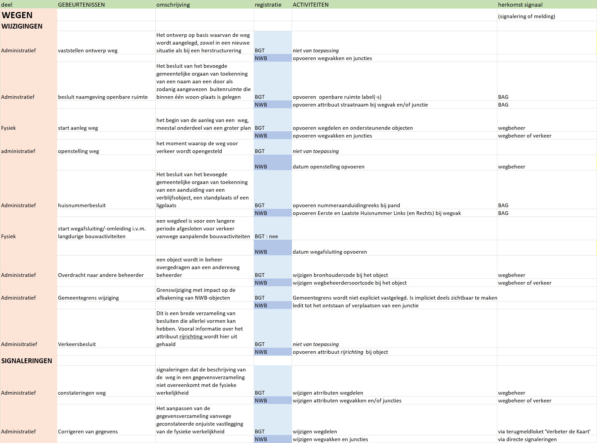

Gebeurtenissen en activiteiten
==============================

In deze handreiking onderscheiden we gebeurtenissen en activiteiten.

Gebeurtenissen
--------------

**Gebeurtenissen** maken deel uit van een groter geheel, een proces.  Een
**proces** bestaat uit een aaneenschakeling van stappen waarbij handelingen
worden uitgevoerd die bijdragen tot het realiseren van een bepaald
eindresultaat. Bijvoorbeeld het proces 'aanleg nieuwe weg' leidt tot het
eindresultaat van een nieuwe weg in de openbare ruimte. Voorbeelden van
gebeurtenissen zijn : 'vaststellen ontwerp weg' en 'openstellen weg'.

Om de gebeurtenissen te ordenen onderscheiden we de procedures Wijzigingen en
Signaleringen. De procedure **Wijzigingen** omvat alle gebeurtenissen en
activiteiten naar aanleiding van een een fysieke of administratieve verandering
van een weg. De procedure **Signaleringen** omvat alle gebeurtenissen en
activiteiten naar aanleiding van de constatering van verandering aan een weg.

**Administratieve gebeurtenissen bij Wijzigingen** zijn:

-   vaststellen ontwerp weg

-   besluit naamgeving openbare ruimte

-   openstelling weg

-   huisnummerbesluit

-   Overdracht naar andere beheerder

-   Gemeentegrens wijziging

-   Verkeersbesluit

**Fysieke gebeurtenissen bij Wijzingen** zijn:

-   start aanleg weg

-   start wegafsluiting/-omleiding i.v.m. langdurige bouwactiviteiten

**Administratieve gebeurtenissen bij Signaleringen** zijn:

-   constateringen weg

-   corrigeren van gegevens

Activiteiten
------------

Een gebeurtenis is aanleiding (trigger) tot **activiteiten** om de registraties
van NWB en/of BGT bij te werken. De activiteit na gebeurtenis 'vaststellen
ontwerp weg' is bijvoorbeeld het opvoeren van planinformatie van de nieuwe weg
in de BGT, de activiteit die hoort bij gebeurtenis 'openstellen weg' is het
aanleveren van gegevens over de nieuwe weg 6 weken voor de openstelling aan het
NWB, en het wijzigen van de planinformatie van de nieuwe weg in bestaande
topografie. Deze activiteiten kunnen in een volgende stap vervolgens worden
geclusterd tot processen.

Nu we de lijst met gebeurtenissen compleet hebben, kunnen we aan de slag met de
activiteiten die moeten worden uitgevoerd als gevolg van elk van deze
gebeurtenissen. Daartoe hebben we een checklist opgesteld, waarvan hieronder een
verkleinde weergave. De checklist is als een losse bijlage beschikbaar. Per
gebeurtenis beschrijven we wát er in elk van de registraties moet gebeuren, en
wat de herkomst is van het signaal dat de start vormt voor de activiteit. Iedere
regel in de checklist vormt de basis voor een of meerdere activiteiten die
moeten worden beschreven en uitgevoerd.

Processen
---------

| De laatste - en meest belangrijke stap - is het vertalen van deze activiteiten naar processtappen en tenslotte naar complete processen. Deze stap laten we graag aan de organisatie zelf. We zijn echter zeer geïnteresseerd in uw eigen uitwerking hiervan. |
|--------------------------------------------------------------------------------------------------------------------------------------------------------------------------------------------------------------------------------------------------------------|
|                                                                                                                                                                                                                                                              |
|                                                                                                                                                                                                                                                              |
|                                                                                                                                                                                                                                                              |
|                                                                                                                                                                                                                                                              |
