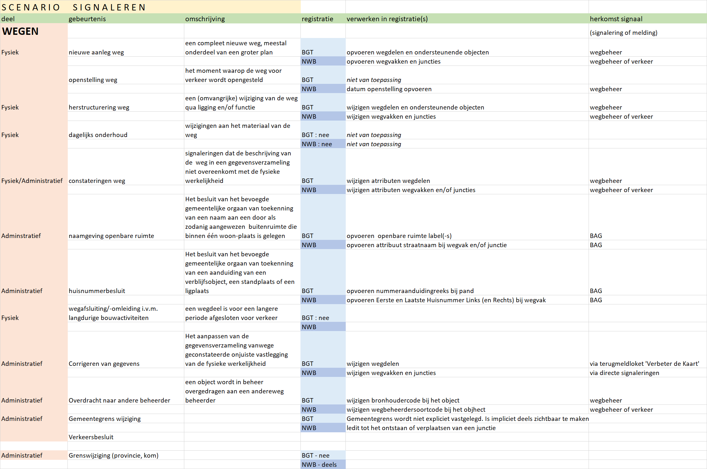

# Gebeurtenissen

Gebeurtenissen zijn voorvallen die plaatsvinden die tot veranderingen kunnen leiden in de registraties van NWB en BGT. 

De trigger kan zijn een fysieke verandering aan de weg, of een administratieve wijziging van een kenmerk van een weg.

Voor NWB en BGT worden de volgende gebeurtenissen relevant geacht:

1. **Aanleg nieuwe weg** een compleet nieuwe weg, meestal onderdeel van een groter plan
2. **Openstelling weg**	het moment waarop de weg voor verkeer wordt opengesteld
3. **Herstructurering weg**	een (omvangrijke) wijziging van de weg qua ligging en/of functie
4. **Dagelijks onderhoud**	wijzigingen aan het materiaal van de weg
5. **Constateringen weg**	signaleringen dat de beschrijving van de  weg in een gegevensverzameling niet overeenkomt met de fysieke werkelijkheid 
6. **Naamgeving openbare ruimte**	Het besluit van het bevoegde gemeentelijke orgaan van toekenning van een naam aan een door als zodanig aangewezen  buitenruimte die binnen één woon­plaats is gelegen
7. **Huisnummerbesluit**	Het besluit van het bevoegde gemeentelijke orgaan van toekenning van een aanduiding van een verblijfsobject, een standplaats of een ligplaats
8. **Wegafsluiting/-omleiding** i.v.m. langdurige bouwactiviteiten	een wegdeel is voor een langere periode afgesloten voor verkeer vanwege aanpalende bouwactiviteiten
9. **Corrigeren van gegevens**	Het aanpassen van de gegevensverzameling vanwege geconstateerde onjuiste vastlegging van de fysieke werkelijkheid
10. **Overdracht naar andere beheerder**	een object wordt in beheer overgedragen aan een andereweg beheerder
11. **Gemeentegrens wijziging**	
12. **Verkeersbesluit**
13. **Grenswijziging (provincie, kom)**	

## Activiteiten
Gebeurtenissen leiden tot **activiteiten** aan de kant van ofwel de wegbeheerder ofwel de bronhouder van de BGT. 

Bij sommige gebeurtenissen bijvoorbeeld dagelijks onderhoud) hoeft een wegbeheerder of bronhouder niks te doen aan de registraties omdat er geen fysieke veranderingen of administratieve wijzigingen optreden.

## Checklist

