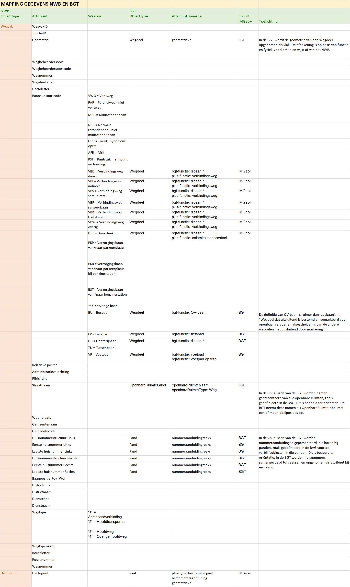

Leveren en melden van mutaties
==============================

Fysieke of administratieve veranderingen aan wegen of besluiten die dat
ondersteunen leiden veelal tot het wijzigen van gegevens van wegen in NWB en/of
BGT. Als NWB en BGT niet in één proces worden bijgehouden - d.w.z. wegbeheerder
en BGT bronhouder voeren elk apart de wijzigingen in de eigen registratie door –
is het van belang om elkaar te **informeren** door mutaties in de eigen
registraties aan de andere partij te leveren en door bij het signaleren van
mogelijke onjuistheden in de andere registratie dit aan de andere partij te
melden.

We onderscheiden drie situaties als **aanleiding** voor het leveren of melden
van mutaties.

1.  De ene partij muteert de eigen gegevens en levert deze mutaties aan de
    andere partij.

2.  De ene partij signaleert dat de situatie in de eigen registratie niet juist
    is, muteert de gegevens in de eigen registratie en levert deze mutaties aan
    de andere partij.

3.  De ene partij signaleert dat de situatie bij de andere partij een mogelijke
    onjuistheid bevat, en meldt dit terug aan de andere partij, die hierop de
    gegevens in de eigen registratie kan aanpassen.

Mutatie- en meldservices
------------------------

Voor het leveren van mutaties en het melden van verschillen onderscheiden we
mutatieservices en meldservices. Een mutatie in de eigen partij wordt via een
**mutatieservice** geleverd aan de andere partij. Een signalering van een
mogelijke onjuistheid bij de andere partij wordt gemeld via een **meldservice**.

Er zijn diverse **bestaande services, portalen en koppelingen** waar NWB en BGT
op kunnen aansluiten.

Bent **wegbeheerder** dan kunt u **gegevens afnemen van de BGT** via de
mutatieservices:

-   **PDOK** is het distributiekanaal van de BGT\|IMGeo gegevens aan afnemers.
    De gegevens zijn open data en worden beschikbaar gesteld als
    <https://www.pdok.nl/nl/producten/pdok-downloads/download-basisregistratie-grootschalige-topografie>
    complete BGT download in de bestandsformaten IMGeo GML, GML Light en
    StUF-Geo IMGeo en via
    <https://www.pdok.nl/nl/producten/pdok-services/overzicht-urls/b> BGT
    webservices (WMTS/TMS). Op moment van schrijven ontwikkelt PDOK een generiek
    formaat voor het leveren van mutaties per objecttype via een API, en wordt
    gewerkt aan de uitbreiding van de webservices met een WMS en WFS.

-   In het
    https://www.geonovum.nl/wegwijzer/standaarden/geo-bor-berichtenverkeer-11
    **Geo-BOR berichtenverkeer** levert de BGT-afdeling in een organisatie
    mutaties naar beheerders van de openbare ruimte (bijv. groen, wegen, water)
    via StUF-Geo IMGeo mutatieberichten.

en kunt u **mogelijke onjuistheden melden aan de BGT** via de meldservices:

-   <https://verbeterdekaart.kadaster.nl/> VerbeterdeKaart is het officiële
    terugmeldsysteem van de Basisregistratie Grootschalige Topografie (BGT). Met
    dit systeem kunnen gebruikers een mogelijke onjuistheid melden door het
    prikken van een puntlocatie op een interactieve kaart en het toevoegen van
    een toelichting.

-   Het **MutatieMeldSysteem** (MMS) van het SVB-BGT helpt bronhouders de
    interne werkvoorraad met openstaande meldingen op BGT-gegevens en
    in-te-meten gebieden bijhouden. Als een bronhouder de wegbeheerder in de
    eigen organisatie toegang geeft kan ook de wegbeheerder meldingen toevoegen
    aan de voorraad.

-   In het
    https://www.geonovum.nl/wegwijzer/standaarden/geo-bor-berichtenverkeer-11
    **Geo-BOR koppelvlak** kan een beheerder van de openbare ruimte (groen,
    wegen, water e.d.) een melding doen aan de BGT dat er in een bepaald gebied
    een verkennend onderzoek nar de situatie of nieuwe inmeting moet worden
    verricht. Dit verzoek wordt uitgewisseld via een StUF-Geo IMGeo
    exploratieverzoek.

Bent **bronhouder** dan kunt u **gegevens afnemen van de NWB** via de
mutatieservices:

-   Via de geoservices van Rijkswaterstaat
    <https://www.rijkswaterstaat.nl/apps/geoservices/geodata/dmc/nwb-wegen/>
    worden de gegevens van het NWB beschikbaar gesteld als downloads volledig
    bestand (*NWB-Wegen*), en een bestand met wijzigingen in het netwerk tussen
    twee peildatums (*NWB-wegen mutaties*). Met een mutatiecode wordt aangegeven
    of een wegvak in die periode is vervallen, gewijzigd of ontstaan. Deze
    mutaties worden beschikbaar gesteld in de uitleverformaten Geographic Data
    Files (GDF) en Shape , Arc Info Coverage (AIC) of Arc Info Export (AIE).

-   In PDOK zijn de gegevens van het NWB beschikbaar als
    <https://www.pdok.nl/nl/producten/pdok-services/overzicht-urls/n>
    webservices in formaat WMS en WFS.

Bent **bronhouder** dan kunt u **mogelijke onjuistheden melden aan het NWB** via
de meldservice:

-   **het NWB-loket** via emailadres <nwb@rws.nl>, met de beschrijving van een
    mogelijke onjuistheid of andere opmerkingen op het NWB.

De lijst met aanleidingen voor het leveren van mutaties en melden van mogelijk
onjuistheden, en de mogelijke mutatie- en meldservices hebben we samengevat in
overzichtstabel, waarvan hieronder een verkleinde weergave. De overzichtstabel
is als een losse bijlage beschikbaar.

Mapping van NWB en BGT gegevens
-------------------------------

Niet elke wijziging van gegevens in de registratie van NWB of BGT is van belang
voor de andere partij. Bijvoorbeeld het wijzigen van een wegbeheerdercode in het
NWB heeft geen vloed op de gegevens van een wegdeel in de BGT, en het wijzigen
van het type verharding van een wegdeel in de BGT is niet van belang voor het
wegvak in het NWB. Daarom hebben we een overzichtstabel opgesteld met welke
gegevens in NWB en BGT een relatie hebben met elkaar en dus relevante mutaties
opleveren (ofwel een **mapping van NWB en BGT gegevens**). Hieronder staat een
verkleinde weergave van deze overzichtstabel. De overzichtstabel is als een
losse bijlage beschikbaar.

