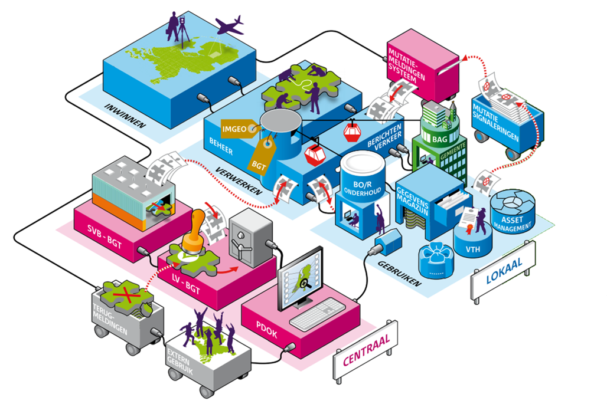

Leveren en melden van mutaties
==============================

Fysieke of administratieve veranderingen aan wegen of besluiten die dat
ondersteunen leiden veelal tot het wijzigen van gegevens van wegen in NWB en/of
BGT. Als NWB en BGT niet in één proces worden bijgehouden - d.w.z. wegbeheerder
en BGT bronhouder voeren elk apart de wijzigingen in de eigen registratie door –
is het van belang om elkaar te **informeren** door mutaties in de eigen
registraties aan de andere partij te leveren en door bij het signaleren van
afwijkingen in de andere registratie dit aan de andere partij te melden.

We onderscheiden drie situaties als **aanleiding** voor het leveren of melden
van mutaties.

1.  De ene partij muteert de eigen gegevens en levert deze mutaties aan de
    andere partij.

2.  De ene partij signaleert dat de situatie in de eigen registratie niet juist
    is, muteert de gegevens in de eigen registratie en levert deze mutaties aan
    de andere partij.

3.  De ene partij signaleert dat de situatie bij de andere partij vermoedelijk
    ten onrechte afwijkt (niet juist of out-of-sync), en meldt dit terug aan de
    andere partij, die hierop de gegevens in de eigen registratie kan aanpassen.

Mutatie- en meldservices
------------------------

Voor het leveren van mutaties en het melden van verschillen onderscheiden we
mutatieservices en meldservices. Een mutatie in de eigen partij wordt via een
**mutatieservice** geleverd aan de andere partij. Een signalering van een
vermoedelijk onterechte afwijking bij de andere partij wordt gemeld via een
**meldservice**.

Er zijn diverse **bestaande services, portalen en koppelingen** waar NWB en BGT
op kunnen aansluiten.

Mutatieservices:

-   PDOK levert als distributiekanaal van de BGT gegevens aan afnemers. De
    gegevens zijn open data en worden beschikbaar gesteld als download
    (totaalstanden) in de bestandsformaten IMGeo GML, GML Light en StUF-Geo
    IMGeo en via webservices (WMTS/TMS). Op moment van schrijven ontwikkelt PDOK
    een generiek formaat voor het leveren van mutaties per objecttype via een
    API, en wordt gewerkt aan de uitbreiding van de webservices met een WMS en
    WFS.

Meldservices

| **Aanleiding**                      | **Toelichting**                                                                         | **Informeren / uitwisselen**                                                                                                          | **Mutatie- of meldservice** | **Bestaande services, portalen en koppelvlakken**                     |
|-------------------------------------|-----------------------------------------------------------------------------------------|---------------------------------------------------------------------------------------------------------------------------------------|-----------------------------|-----------------------------------------------------------------------|
| **Signalering door wegbeheerder**   | Wegbeheerder signaleert dat de situatie in de BGT vermoedelijk ten onrechte afwijkt.    | Wegbeheerder meldt signalering direct aan BGT bronhouder.                                                                             | Meldservice                 | Mutatiemeldsysteem (MMS)                                              |
|                                     |                                                                                         |                                                                                                                                       |                             | Geo-BOR koppelvlak (StUF-Geo IMGeo exploratieverzoek)                 |
|                                     |                                                                                         | Wegbeheerder meldt signalering aan BGT terugmeldvoorziening. BGT bronhouder krijgt melding doorgestuurd via BGT terugmeldvoorziening. | Meldservice                 | Verbeterdekaart.nl                                                    |
|                                     | Wegbeheerder signaleert uit de BGT dat de situatie in het NWB niet juist is.            | Niet van toepassing. Wegbeheerder past zelf NWB aan. Geen uitwisseling tussen NWB en BGT.                                             | n.v.t.                      | n.v.t.                                                                |
| **Signalering door BGT bronhouder** | BGT bronhouder signaleert dat de situatie in het NWB vermoedelijk ten onrechte afwijkt. | BGT bronhouder meldt signalering direct aan wegbeheerder.                                                                             | Meldservice                 | *Email*                                                               |
|                                     |                                                                                         | BGT bronhouder meldt signalering aan NWB-loket. Wegbeheerder krijgt melding via NWB-loket.                                            | Meldservice                 | NWB-loket                                                             |
|                                     | BGT bronhouder signaleert uit het NWB dat de situatie in de BGT niet juist is.          | Niet van toepassing. BGT bronhouder past zelf BGT aan. Geen uitwisseling tussen BGT en NWB.                                           | n.v.t.                      | n.v.t.                                                                |
| **Mutatie door wegbeheerder**       | Wegbeheerder voert wijziging van gegevens door in het NWB.                              | Wegbeheerder stuurt mutatie door aan BGT bronhouder.                                                                                  | Mutatieservice              | Geo-BOR koppelvlak (StUF-Geo IMGeo mutatieverzoek)                    |
|                                     |                                                                                         | Wegbeheerder stuurt mutatie door aan NWB-loket. BGT bronhouder neemt mutaties af van NWB-loket.                                       | Mutatieservice              | NWB-loket                                                             |
| **Mutatie door BGT bronhouder**     | BGT bronhouder voert wijziging van gegevens door in de BGT.                             | BGT Bronhouder stuurt mutatie direct door aan wegbeheerder.                                                                           | Mutatieservice              | Geo-BOR koppelvlak (StUF-Geo IMGeo mutatiebericht)                    |
|                                     |                                                                                         | BGT Bronhouder stuurt mutatie aan LV-BGT. Wegbeheerder neemt mutaties af van LV-BGT.                                                  | Mutatieservice              | PDOK (GML downloads, StUF-Geo IMGeo generieke mutatielevering of WFS) |

Activiteiten uit gebeurtenissen leiden tot het wijzigen van gegevens in de
registraties van NWB en/of BGT. Als de ene partij aanpast, zal de andere partij
mee moeten aanpassen om beide registraties actueel en consistent met elkaar te
houden. Dat betekent dat als de BGT wordt aangepast er op de ene of andere
manier een signaal van bronhouder naar wegbeheerder moet gaan, en vice versa,
zodanig dat wijzigingen die relevant zijn voor de andere partij worden
opgemerkt.

In dit kader onderscheiden we twee typen signalen:

1.  Met een **mutatie** bedoelen we een signaal in de vorm van een
    gegevensbestand in een vast uitwisselformaat waarin de wijziging (was-wordt)
    van één of meer kenmerken van het object exact wordt doorgegeven. Software
    kan deze wijziging veelal automatisch overnemen in registraties.

2.  Met een **melding** bedoelen we een signaal dat er een wijziging in een
    bepaald gebied heeft plaatsgevonden, waarin wordt beschreven (toelichtende
    tekst) op welke manier gegevens zijn gewijzigd of geconstateerd zijn dat
    deze gegevens afwijken. De ontvanger van een melding zal zelf onderzoek
    moeten doen op welke manier deze gegevens al dan niet overgenomen moeten
    worden in registraties. Veelal worden meldingen achteraf verstuurd door
    gebruikers die een wijziging of onjuistheid in de gegevens hebben
    geconstateerd (=signalering).

Hierna zullen we een aantal bestaande kanalen schetsen waarin meldingen en
mutaties voor NWB en BGT worden uitgewisseld. Organisaties kunnen hier voor hun
eigen bijhoudingsproces op aansluiten. Welk kanaal een organisatie kiest, laten
we graag over aan de bronhouder en wegbeheerder van een organisatie.

Mutaties van en meldingen naar NWB
----------------------------------

Gegevens van het NWB zijn beschikbaar in verschillende producten als downloads
via Rijkswaterstaat
[https://www.rijkswaterstaat.nl/apps/geoservices/geodata/dmc/nwb-wegen/]: o.a.
een volledig bestand NWB-Wegen, en een bestand met wijzigingen in het netwerk
tussen twee peildatums, zijnde **NWB-wegen mutaties**. Met een mutatiecode wordt
aangegeven of een wegvak in die periode is vervallen, gewijzigd of ontstaan.
Deze mutaties worden beschikbaar gesteld in de uitleverformaten Geographic Data
Files (GDF) en Shape , Arc Info Coverage (AIC) of Arc Info Export (AIE).

Een melding met een geconstateerde wijzigingen en/of opmerkingen betreffende het
NWB kunnen via **het NWB-loket** op emailadres nwb\@rws.nl ingediend worden.

Mutaties van en meldingen naar BGT
----------------------------------

Mutaties van en meldingen op BGT-gegevens kunnen via verschillende kanalen
worden afgenomen of doorgegeven. Onderstaande figuur toont de uitwisseling van
mutaties en meldingen in de BGT-keten.

Mutaties op BGT objecten worden op drie plekken in de BGT keten uitgewisseld: 1.
Via **PDOK** worden de gegevens in de Landelijke Voorziening verstrekt aan
afnemers via **web service (WMTS) en GML en StUF-Geo IMGeo downloads** van
totaalstanden. Op dit moment (februari 2018) werkt PDOK aan een generiek
XML/GML-uitwisselformaat voor levering van mutaties in verschillende
basisregistraties (BGT, BRK, BAG) aan afnemers. 2. Via **BRAVO** worden **via
een abonnementenservice de mutaties** door andere bronhouders verstuurd naar
geraakte bronhouders. De mutaties worden uitgewisseld in een StUF-Geo IMGeo
mutatiebericht. 3. In het **Geo-BOR koppelvlak** worden **mutaties op
BGT-objecten** door de Geo-afdeling in een organisatie verstuurd naar de
afdeling Beheer Openbare Ruimte (BOR), die deze gegevens nodig heeft voor
groenbeheer, wegbeheer e.d. Een BOR-beheerder kan ook bij een voorgenomen of
geconstateerde wijziging op de eigen beheerobjecten (bijvoorbeeld
groenvoorzieningen of wegen) een verzoek met wijziging van gegevens aan Geo
sturen. De mutaties worden uitgewisseld in een StUF-Geo IMGeo mutatiebericht of
mutatieverzoek.

Meldingen over geconstateerde wijzigingen/onjuistheden van BGT-gegevens worden
op drie plekken in de BGT keten doorgegeven aan bronhouders: 1. Via
**Verbeterdekaart** kan een gebruiker van BGT-gegevens een **terugmelding**
doen, door het prikken van een puntlocatie op een interactieve kaart en een
toelichting te geven over de geconstateerde afwijking tussen kaart en
werkelijkheid. Verbeterdekaart is het offciële terugmeldsysteem (TMS) voor de
BGT. 2. Via het **MutatieMeldSysteem** (MMS) van het SVB-BGT kunnen bronhouders
de interne werkvoorraad met openstaande meldingen op BGT-gegevens en in-te-meten
gebieden bijhouden. 3. In het **Geo-BOR koppelvlak** kan een BOR-beheerder een
verzoek doen aan de Geo-afdeling om een bepaald gebied te onderzoeken en evt.
opnieuw in te meten. Dit verzoek wordt uitgewisseld in een StUF-Geo IMGeo
exploratieverzoek.

Relevante mutaties
------------------

Niet alle wijzigingen in de registraties van NWB en BGT zijn van belang voor de
de andere partij. Bijvoorbeeld het wijzigen van een wegbeheerdercode in het NWB
heeft geen vloed op de gegevens van een wegdeel in de BGT, en het wijzigen van
het type verharding van een wegdeel in de BGT is niet van belang voor het wegvak
in het NWB. Daarom schetsen we hierna welke gegevens in NWB en BGT een relatie
hebben met elkaar (mapping).

**Objecten**

...

**Geometrie**

...

**Attributen**

In bijlage xx.xx. staat een tabel met een mapping van de gegevens tussen het NWB
wegvak en objecten in de BGT
